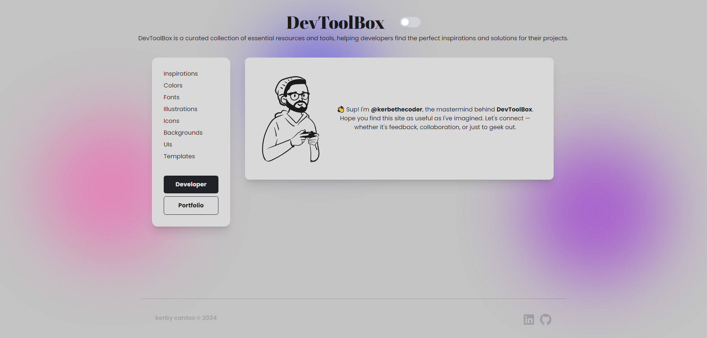

 

"[Vue](https://vuejs.org/) is a JavaScript framework for building user interfaces. It builds on top of standard HTML, CSS, and JavaScript and provides a declarative, component-based programming model that helps you efficiently develop user interfaces of any complexity."

This guide provides a first-hand experience on building a Vue project using [Vite](https://vitejs.dev/guide/#scaffolding-your-first-vite-project) + [Tailwind CSS](https://tailwindcss.com/docs/guides/sveltekit) and deploying it on [GitHub Pages](https://pages.github.com/).

## 🛠️ Installation

**1. Create your project.**
You can use the [official guide](https://vuejs.org/guide/quick-start#creating-a-vue-application) or use **Vite** like this.

```bash
# terminal
npm create vite@latest project_name -- --template vue
cd project_name
```

**2. Install Tailwind CSS.**

```bash
# terminal
npm install -D tailwindcss postcss autoprefixer
npx tailwindcss init -p
```

**3. Configure template paths.**

```js
// tailwind.config.js
/** @type {import('tailwindcss').Config} */
export default {
  content: ['./index.html', './src/**/*.{vue,js,ts,jsx,tsx}'],
  theme: {
    extend: {},
  },
  plugins: [],
};
```

**4. Add the Tailwind directives.**

```css
/* ./src/style.css */
@tailwind base;
@tailwind components;
@tailwind utilities;
```

**5. Start your build process.**

```bash
# terminal
npm run dev
```

**6. Happy coding. ^^**

```html
<!-- App.vue -->
<template>
  <h1 class="text-3xl font-bold underline">Hello world!</h1>
</template>
```

## 🗂️ File Structure

Sample project structure.

```
my-vue-app/
├── public/
│   ├── favicon.ico
│   └── ...
├── src/
│   ├── assets/
│   │   └── logo.png
│   ├── components/
│   │   └── HelloWorld.vue
│   ├── views/
│   │   └── Home.vue
│   ├── App.vue
│   ├── main.js
│   └── router.js
├── .gitignore
├── index.html
├── package.json
├── README.md
└── vite.config.js
```

## 🛫 How to deploy to GitHub Pages

Deploying to github pages is totally up to you, be it through **[GitHub Actions](https://docs.github.com/en/actions/deployment/about-deployments/deploying-with-github-actions)**, or via **[gh-pages](https://www.npmjs.com/package/gh-pages)** package, or manually.

> [!NOTE]
>
> Also take note that [GitHub Pages](https://pages.github.com/) have limitations, it's free, yes, but it has a limit.

### ❗ via package ❗

**1. Install `gh-pages` package.**

```bash
npm install gh-pages --save-dev
```

**2. Add base path to your repo in `vite.config.js`.**

```js
// vite.config.js
import { defineConfig } from 'vite';
import vue from '@vitejs/plugin-vue';

// https://vitejs.dev/config/
export default defineConfig({
  plugins: [vue()],
  base: '/vue', // repo-name
});
```

**3. Add `deploy` to your scripts.**

```json
{
  "scripts": {
    "deploy": "npm run build && gh-pages -d dist"
  }
}
```

**4. Create and configure a new branch for `gh-pages`.**

> [!IMPORTANT]
>
> Make sure that you have committed your changes before doing this. All untracked and staged files may be deleted.

I like to do this manually. If there is some automated way, feel free to let me know by any means.

```bash
git checkout --orphan gh-pages
git reset --hard
git commit --allow-empty -m 'commit_message'
git push origin gh-pages
```

**5. Publish the production build.**

```bash
npm run deploy
```

### ❗ via manually configuring github pages settings ❗

**1. Create your project.**
Start coding your project, either use a framework like React, Vue, or not.

**2. Publish production build to GitHub.**
Push your _production build_ to your github repo. After that, check if your `index.html` file is uploaded, since it is one of the core files needed for your website to work.

**3. Configure your GitHub Pages on repo Settings.**
Navigate to `Settings > Pages > Build and deployment`. Make sure the **Source** says 'Deploy from a branch', and then configure the **Branch** settings and change it to your branch with the files.

---

🌎 [kerbethecoder](https://kerbethecoder.com/)  
📫 krby.cnts@gmail.com  
📌 July 31, 2024
